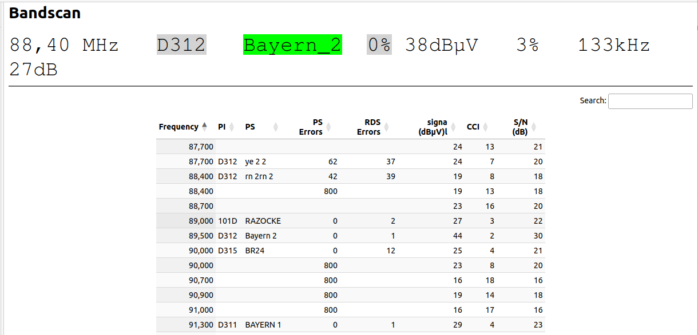
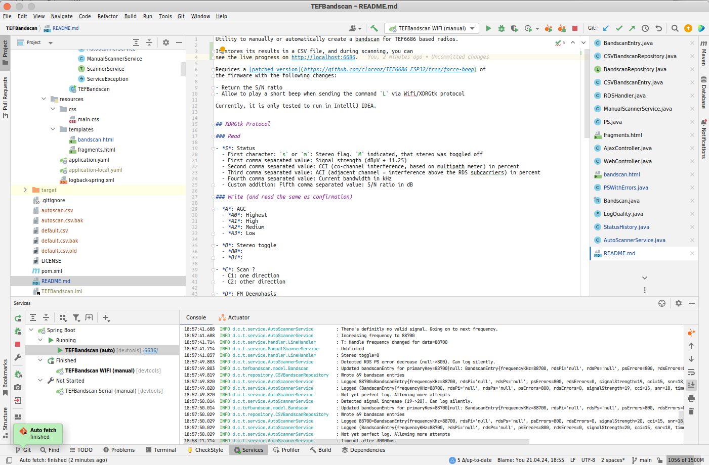

Utility to manually or automatically create a bandscan for TEF6686 based radios.

It stores its results in a CSV file, and during scanning, you can
see the (yet very, very rough) live progress on http://localhost:6686 

Requires a [patched version](https://github.com/clorenz/TEF6686_ESP32/tree/force-beep) of 
the firmware with the following changes:

- Return the S/N ratio
- Allow to play a short beep when sending the command `L` via Wifi/XDRGtk protocol

Currently, it is only tested to run in IntelliJ IDEA.

Since it currently not more than a proof-of-concept, chances are high,
that everything will change any time ;-)

See more documentation in the [doc](doc/) folder.

## Usage

Currently, it is not yet possible to run it outside an IDE, but you can configure the
modes and the name of the CSV. Please note, that currently only the WIFI connection works.
Its credentials are in `src/main/resources/application.yaml` and must be configured once.

### Manual scan mode

In this mode, you scan manually, and whenever TEFBandscan creates a log (either for the first
time, or when an existing log can be improved), you get an acoustic feedback, a short beep, on
your TEF receiver (only, when you use the patched version).

The verbose logging on STDOUT (not to be mixed with the structured CSV logging!) will give you 
an impression, what happened.

To start, just set the CSV "database" name as parameter, e.g. `--database=manual`. If this
parameter is not given, the logging is done into the default CSV file, called `default.csv`.

### Automatic scan mode

In this mode, the TEF receiver scans eternally, and every time, it sees a valid new reception, or
it can improve an already existing log, it creates or updates a log entry. Currently, you don't get
any feedback on your device, but the textual logging on STDOUT is pretty verbose.

To start, you must set the parameter `--auto` and provide the CSV "database" name,
e.g. `--database=auto`. If no "database" name is given, the logging is done into
the default CSV file, called `default.csv`.
